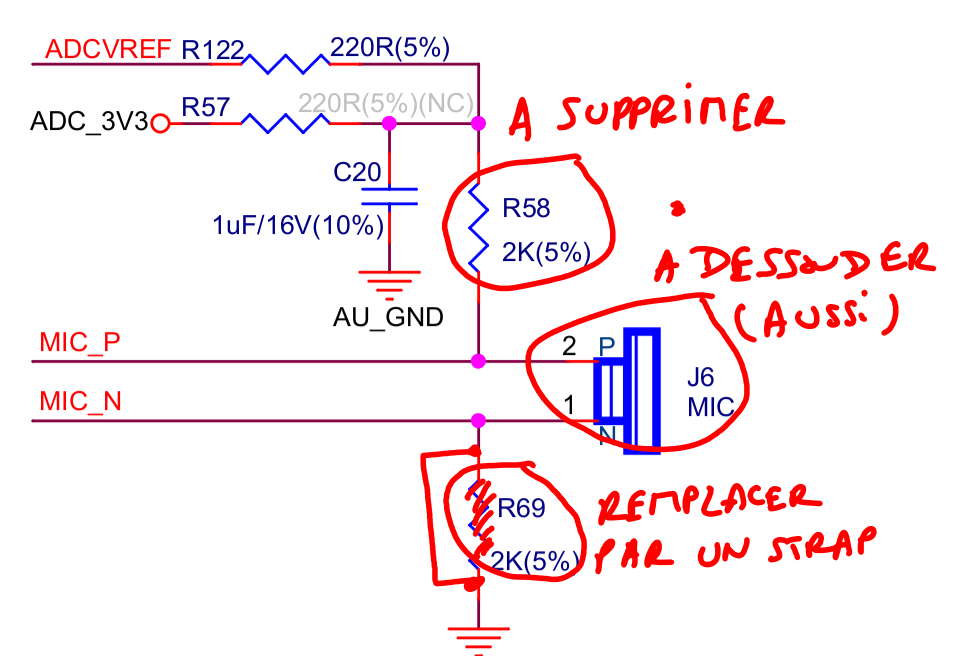
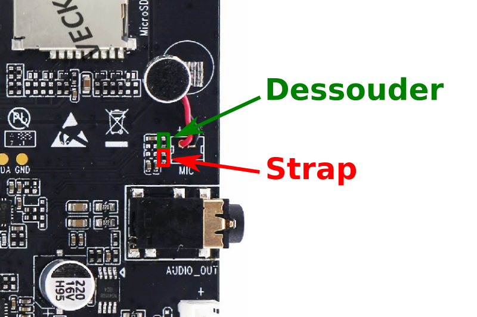
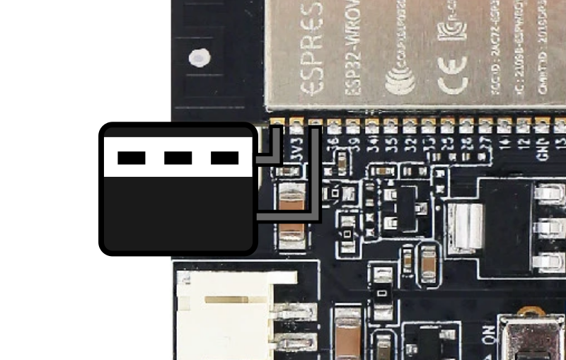

# Conversion de deux téléphones S63 en interphones WiFi
{:.no_toc}

1. The generated Toc will be an ordered list
{:toc}

## Préparation du téléphone

### Démontage du téléphone

### Retrait des composants

## Modification de la carte ESP32-Lyrat-Mini

### Modification de l'entrée microphone pour accepter un micro externe

Dans la conception d'origine de la *board* Esp32-Lyrat-Mini version 1.2, il n'y a pas de moyen prévu pour connecter un microphone externe. Pour ce faire, il faut apporter quelques modifications au schéma électronique de celle-ci:

Ce qui se traduit par les modifications suivantes sur la carte Esp32-Lyrat-Mini:

Et bien sûr, il faut dessouder le microphone electret présent sur la carte !

### Modification pour alimenter la carte avec un seul câble USB

Le design de la carte n'est pas prévu pour que cette dernière puisse être alimentée avec un seul câble USB (connecté au connecteur femelle USB POWER 1). Pour que cela soit possible, il faut *booster* légèrement le condensateur relié à la borne *EN* du module ESP32 avec un condensateur de 100uF (minimum requis, idéalement 220uF). Ce condensateur doit être soudé entre les broches *GND* et *EN*, comme indiqué ci-dessous:

### Soudure des fils du haut-parleur

Le haut-parleur est connecté d'une part à une des broches du connecteur de sortie (+), et d'autre part à la masse. De cette façon, nous n'auront besoin que d'un seul fil pour le signal audio à envoyer au haut-parleur, avec toutefois une perte en amplitude du signal. 
**TODO**: insérer une photo

## Modification du combiné du téléphone

### Retrait du microphone d'origine

### Installation d'un module MAX9814

### Connexion à la platine

